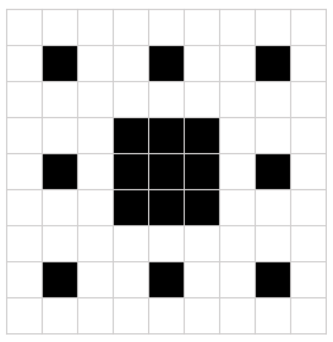

# [프랙탈 평면](https://www.acmicpc.net/problem/1030)

| 시간 제한 | 메모리 제한 |
| :-------: | :---------: |
| 2 초      | 128 MB      |

## 문제

프렉탈 평면은 다음과 같이 커진다. 시간 0에서 프렉탈은 흰색 정사각형 하나이다. 단위 시간(1)이 진행될 때마다 N×N개의 크기가 동일한 단위 정사각형으로 나누어진다. 만약 나누어진 정사각형이 흰색이라면 가운데 K×K 정사각형이 검정색으로 채워진다. N과 K는 둘 다 홀수이거나, 둘 다 짝수이다.

예를 들어, N=3, K=1이라면, 시간 1에 3×3 정사각형이 된다. 가운데 정사각형은 검정색이고, 나머지는 흰색이 된다. 시간 2때 9×9 정사각형이 되고, 17개는 검정이고, 나머지는 흰색이다.

s, N, K, R1, R2, C1, C2가 주어질 때, 시간 s일 때, R1행 C1열부터 R2행 C2열까지의 모습을 출력하는 프로그램을 작성하시오.

## 입력

첫째 줄에 7개의 정수 s, N, K, R1, R2, C1, C2가 주어진다.

## 출력

첫째 줄에 문제의 정답을 출력한다. 첫째 줄에 R1행의 모습을 출력하고 이런 식으로 총 R2-R1+1개의 줄에 출력하면 된다. 각 행의 모습을 출력할 때, C1열부터 C2열까지 차례대로 흰색이면 숫자 '0' 검정이면 숫자 '1'을 출력한다. 숫자 사이에 공백을 넣으면 안 된다.

## 제한

* 0 ≤ s ≤ 10
* 3 ≤ N ≤ 8
* 1 ≤ K ≤ N - 2
* (N - K) mod 2 = 0
* 0 ≤ R1, R2, C1, C2 ≤ Ns - 1
* R1 ≤ R2 ≤ R1 + 49
* C1 ≤ C2 ≤ C1 +49

