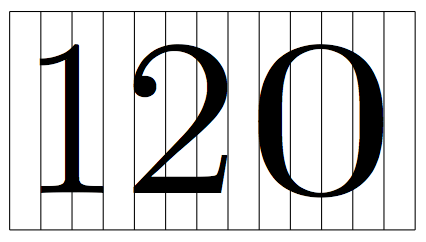

# [집 주소](https://www.acmicpc.net/problem/1284)

| 시간 제한 | 메모리 제한 |
| :-------: | :---------: |
| 1 초      | 128 MB      |

## 문제

재석이는 대문에 붙이는 (주소를 나타내는) 호수판 제작업체의 직원이다. 고객에게 전달할 호수판은 숫자와 숫자 사이 그리고 왼쪽 오른쪽으로 적당히 여백이 들어가 줘야하고 숫자마다 차지하는 간격이 조금씩 상이하다. 다행이도 규칙은 매우 간단하다.

1. 각 숫자 사이에는 1cm의 여백이 들어가야한다.
2. 1은 2cm의 너비를 차지해야한다. 0은 4cm의 너비를 차지해야한다. 나머지 숫자는 모두 3cm의 너비를 차지한다.
3. 호수판의 경계와 숫자 사이에는 1cm의 여백이 들어가야한다.

예를 들어 위의 120 같은 경우,  각 숫자 사이에 여백이 1cm 씩 2개 들어간다. 1은 2cm, 2는 3cm, 0은 4cm를 차지한다. 오른쪽, 왼쪽 경계에서 각각 여백이 1cm씩 차지한다. 따라서 총 2 + 2 + 3 + 4 + 1 + 1 = 13(cm) 가 된다.

재석이는 고객에게 전달해야할 호수판의 너비가 얼마나 되는지 궁금해졌다. 재석이를 도와주자!

## 입력

호수판에 들어갈 숫자 N의 범위는 1 ≤ N ≤ 9999 이다.

입력은 마지막에 0이 들어오기 전까지 계속해서 줄 단위로 주어진다.

또한, 마지막의 0은 처리하지 않는다.

## 출력

각 입력마다 얼마만큼 너비를 차지하는지 정수로 출력하면 된다.

각 출력은 줄바꿈으로 구분되어야한다.

