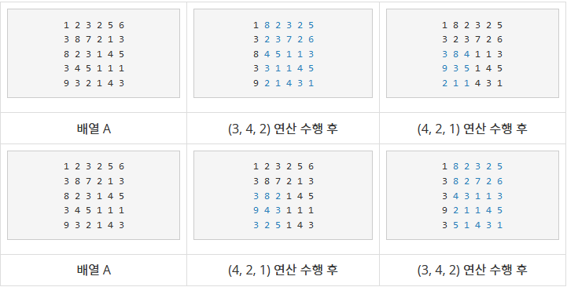

# [배열 돌리기 4](https://www.acmicpc.net/problem/17406)

| 시간 제한 | 메모리 제한 |
| :-------: | :---------: |
| 1 초      | 512 MB      |


## 문제

크기가 N×M 크기인 배열 A가 있을때, 배열 A의 값은 각 행에 있는 모든 수의 합 중 최솟값을 의미한다. 배열 A가 아래와 같은 경우 1행의 합은 6, 2행의 합은 4, 3행의 합은 15이다. 따라서, 배열 A의 값은 4이다.

```
1 2 3
2 1 1
4 5 6
```

배열은 회전 연산을 수행할 수 있다. 회전 연산은 세 정수 (r, c, s)로 이루어져 있고, 가장 왼쪽 윗 칸이 (r-s, c-s), 가장 오른쪽 아랫 칸이 (r+s, c+s)인 정사각형을 시계 방향으로 한 칸씩 돌린다는 의미이다. 배열의 칸 (r, c)는 r행 c열을 의미한다.

예를 들어, 배열 A의 크기가 6×6이고, 회전 연산이 (3, 4, 2)인 경우에는 아래 그림과 같이 회전하게 된다.

```
A[1][1]   A[1][2] → A[1][3] → A[1][4] → A[1][5] → A[1][6]
             ↑                                       ↓
A[2][1]   A[2][2]   A[2][3] → A[2][4] → A[2][5]   A[2][6]
             ↑         ↑                   ↓         ↓
A[3][1]   A[3][2]   A[3][3]   A[3][4]   A[3][5]   A[3][6]
             ↑         ↑                   ↓         ↓
A[4][1]   A[4][2]   A[4][3] ← A[4][4] ← A[4][5]   A[4][6]
             ↑                                       ↓
A[5][1]   A[5][2] ← A[5][3] ← A[5][4] ← A[5][5] ← A[5][6]

A[6][1]   A[6][2]   A[6][3]   A[6][4]   A[6][5]   A[6][6]
```

회전 연산이 두 개 이상이면, 연산을 수행한 순서에 따라 최종 배열이 다르다.

다음은 배열 A의 크기가 5×6이고, 회전 연산이 (3, 4, 2), (4, 2, 1)인 경우의 예시이다.



배열 A에 (3, 4, 2), (4, 2, 1) 순서로 연산을 수행하면 배열 A의 값은 12, (4, 2, 1), (3, 4, 2) 순서로 연산을 수행하면 15 이다.

배열 A와 사용 가능한 회전 연산이 주어졌을 때, 배열 A의 값의 최솟값을 구해보자. 회전 연산은 모두 한 번씩 사용해야 하며, 순서는 임의로 정해도 된다.


## 입력

첫째 줄에 배열 A의 크기 N, M, 회전 연산의 개수 K가 주어진다.

둘째 줄부터 N개의 줄에 배열 A에 들어있는 수 A[i][j]가 주어지고, 다음 K개의 줄에 회전 연산의 정보 r, c, s가 주어진다.


## 출력

배열 A의 값의 최솟값을 출력한다.


## 제한

* 3 ≤ N, M ≤ 50
* 1 ≤ K ≤ 6
* 1 ≤ A\[i\]\[j\] ≤ 100
* 1 ≤ s
* 1 ≤ r-s < r < r+s ≤ N
* 1 ≤ c-s < c < c+s ≤ M

