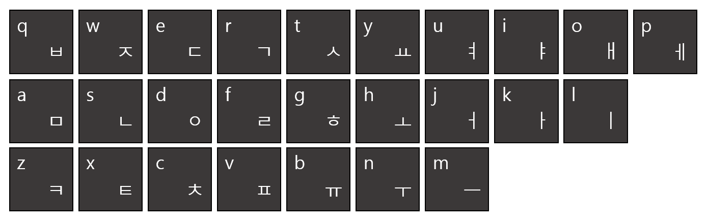

# [ZOAC 3](https://www.acmicpc.net/problem/20436)

| 시간 제한 | 메모리 제한 |
| :-------: | :---------: |
| 1 초      | 1024 MB     |

## 문제

2020년 12월, 세 번째로 개최된 ZOAC의 오프닝을 맡은 성우는 누구보다 빠르게 ZOAC를 알리려 한다.

하지만 안타깝게도 성우는 독수리타법이다!

* 독수리 타법이란 양 손의 검지손가락만을 이용해 타자를 치는 타법이다.
* 성우는 한글 자음 쪽 자판은 왼손 검지손가락으로 입력하고, 한글 모음 쪽 자판은 오른손 검지손가락으로 입력한다.
* a의 좌표가 (x1, y1)이고, b의 좌표가 (x2, y2)일 때, a에 위치한 성우의 손가락이 b로 이동하는 데에는 a와 b의 택시 거리 |x1-x2|+|y1-y2| 만큼의 시간이 걸린다.
* 각 키를 누르는 데에는 1의 시간이 걸린다.
* 성우는 두 손을 동시에 움직일 수 없다.
* 성우가 사용하는 키보드는 쿼티식 키보드이며, 아래 그림처럼 생겼다.  
  

바쁜 성우를 위하여 해당 문자열을 출력하는 데 걸리는 시간의 최솟값을 구해보자.

## 입력

첫 번째 줄에는 두 알파벳 소문자 sL, sR이 주어진다. sL, sR은 각각 왼손 검지손가락, 오른손 검지손가락의 처음 위치이다.

그 다음 줄에는 알파벳 소문자로 구성된 문자열이 주어진다. 문자열의 길이는 최대 100자이다. 빈 문자열은 주어지지 않는다.

## 출력

입력으로 주어진 문자열을 출력하는 데에 걸리는 시간의 최솟값을 출력한다.

## 힌트

성우가 두 손을 동시에 움직이지 못하는 이유는 다음과 같다.

* 사람은 두 가지 이상의 일을 동시에 할 수 없다.
* 대학원생은 사람이다.
* 성우는 대학원생이다.

